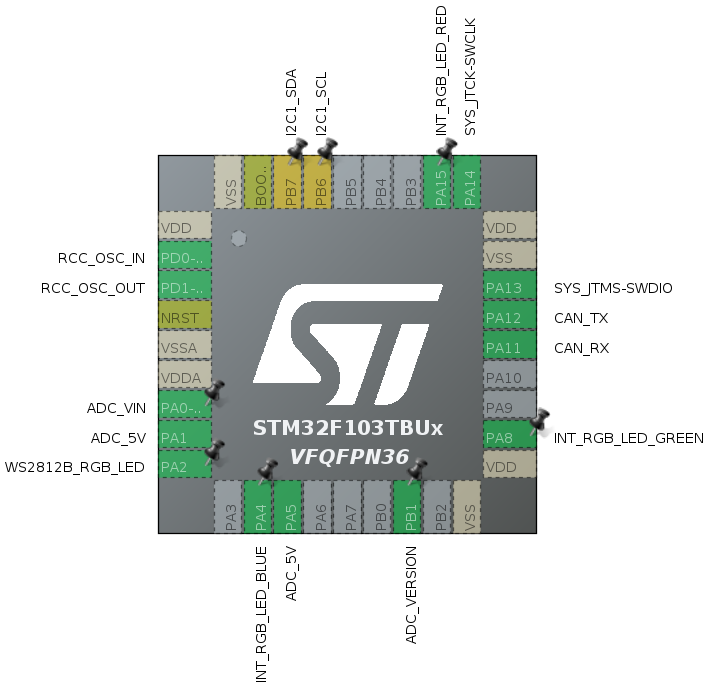

# RaccoonLab lights-v0 node

This is a repository for RaccoonLab lights v2 node.

The core of this repository is the .ioc file that defines the stm32 peripherals with respect to what a real device has.

The peripheral configuration is shown below:

Additionally, the reposity has a source code generated with STM32CubeMX v6.6.0 using STM32Cube FW_G0 V1.6.1 for STM32CubeIDE usage.

Feel free to write your own custom firmware to test some features or suggest something.

The entry point is Core/Src/main.c. This file initializes all the peripherals and then goes to application_entry_point(). This is where a custom user logic is expected to be implemented.

Reference:
- Hardware: https://docs.raccoonlab.co/guide/ui_leds/hardware.html
- Docs: https://docs.raccoonlab.co/guide/ui_leds/
- Usage example: https://github.com/RaccoonlabDev/lights-node
